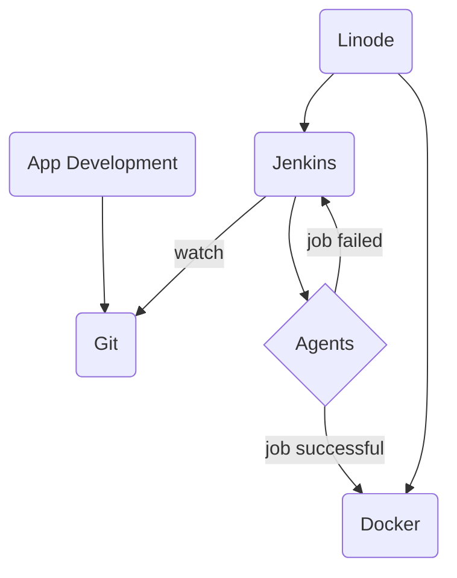

# Jenkins

It is an automation server

## General Terms
- **Continuous integration**: It is the practice of automating the integration
  of code changes from multiple contributors into a single software project.
  Automated tools are used to assert the new code's correctness before
  integration.
- **Continuous delivery**: It is an extension of continuous integration since
  it automatically deploys all code changes to a testing and/or production
  environment after the build stage. This means that on top of automated
  testing, you have an automated release process and you can deploy your
  application any time by clicking a button.
- **Pipeline**: Series of steps that build, test, and deploy automatically to
  environments.

## Jenkins Terms
- **Controller**: The central, coordinating process which stores configuration,
  loads plugins, and renders the varous user interfaces for jenkins.
- **Agent**: An agent is typically a machine, or container, which connects to a
  Jenkins controller and executes tasks when directed by the controller.
- **Artifact**: An immutable file generated during *Build* or *Pipeline* run
  which is archived onto the jenkins *Controller* for later retrieval by users.

